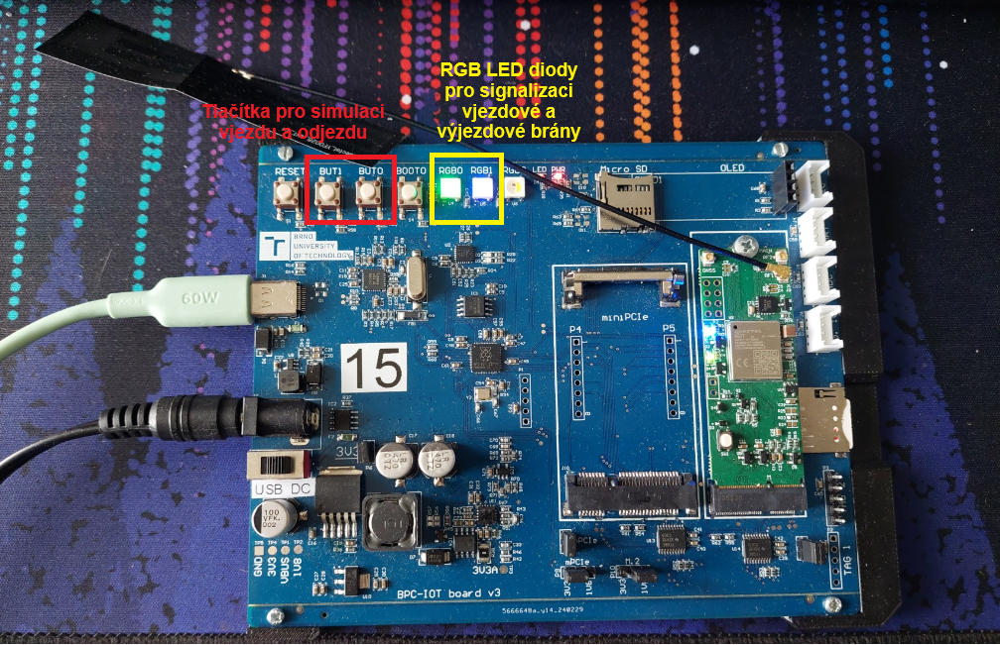
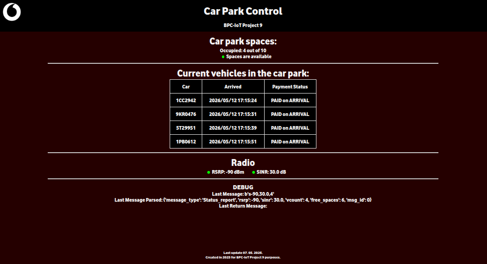

# 🚥🚗Parking space monitoring system
A semestral project for a BPC-IOT course at BUT FEEC.
Technical description is in Czech (at least temporarily).

### Vypracovali:
Vojtěch Trunda ID: \
Petr Křupka ID: 256768\
Jan Baňař ID: 256720\
Filip Křivánek ID: 260524

Cílem projektu je vytvoření řešení pro správu podzemního parkoviště. Systém detekuje příjezd jednotlivých vozidel, zaznamenává jejich RZ a odesílá data prostřednictvím LPWAN sítě na server. Tam jsou data zpracována a zobrazena ve webovém rozhraní (viz *Obr. 5*), které poskytuje přehled o aktuální obsazenosti a kvalitě radiového signálu. 

> [!IMPORTANT]
> Kompletní zadání projektu [zde.](Projekt9.pdf)

## Návrh technického řešení.
Zařízení slouží pro vzdálený monitoring volných parkovacích míst.
- **Detekce vozidla:** místo ultrazvukových senzorů jsou pro simulaci vjezdu a výjezdu použita tlačítka.
- **Kapacita:** systém monitoruje zaplněnost v rámci nastavené kapacity v `config.py`. Aktuální registrační značky zaparkovaných vozidel jsou ukládány do lokálního souboru `spz.txt`.
- **Vizuální signalizace:** Stav parkoviště (volno/obsazeno) a akce (vjezd/výjezd) jsou znázorněny pomocí tří RGB LED diod.
- **Čtení RZ:** při vjezdu je náhodně generována RZ (simulujeme přečtení RZ kamerou), která je následně odeslána na server a uložena.

## Popis vaší aplikace.
Aplikace je postavena na bázi stavového automatu v jazyce *MicroPython*, který v hlavní smyčce preiodicky kontroluje stavy tlačítek a spravuje komunikační modul.
- **Inicializace:** po startu aplikace inicializuje UART rozrhaní pro komunikaci s modemem **BG77**, nastaví APN a provede registraci do sítě s prioritou pro **LTE Cat-M**.
- **Logika vjezdu/výjezdu:** Při detekci stisku tlačítka (vjezd nebo výjezd) dojde k aktualizaci vizuální signalizace, manipulaci se seznamem RZ v souboru `spz.txt` a okamžitému odeslání **UDP** datagramu na server.
- **Diagnostika:** nezávisle na provozu běží časovač (*Timer*), který periodicky spouští funkci pro vyčtení rádiových parametrů sítě (**RSRP, SINR**) a odesílá je jako stavovou zprávu.
- Systém využívá lokální persistenci dat, tedy po restartu pokračuje s aktuálním počtem vozidel uloženým v souboru `spz.txt`.
  
## Využité komponenty.
HARDWARE\
Hlavní komponentou je vývojová deska **BPC-IOT board v3**.
- Mikrokontrolér s podporou *MicroPython* - **Raspberry Pi Pico**
- Komunikační modul **Quectel BG77**
- 3x RGB LED dioda pro signalizaci
- 2x mikrospínač pro simulaci vjezdu a výjezdu

SOFTWARE
- Knihovna `BG77.py` pro ovládání modemu pomocí AT příkazů.
- Modul `config.py` pro konfiguraci sítě a parametrů parkoviště.
- Webové rozhraní pro zobrazení stavu parkoviště


> Obr. 1: BPC-IOT board v3

## Volba použité přenosové technologie a zdůvodnění.
Pro přenos dat z koncového zařízení na server byly zvoleny technologie LPWAN sítě konkrétně **NB-IoT** a **LTE Cat-M**. Tyto technologie byly vybrány s ohledem na požadavky aplikace:
- Dobrý průnik signálu překážkami (vhodné pro podzemní parkoviště).
- Dostatečná přenosová kapacita pro zasílání krátkých zpráv o stavu parkoviště.
- Bezpečnost díky využití licencovaného pásma mobilních operátorů (v tomto případě síť Vodafone).
- Nízká perioda projíždějících aut (jedno auto za 5 minut)

## Volba Transportního protokolu a zdůvodnění.
Byl zvolen transportní protokol **UDP** s ohledem na malé množství režijních dat nutných pro přenos.
Potvrzování vybraných zpráv lze v tomto případě přenést na aplikační úroveň.

## Volba Aplikačního protokolu a zdůvodnění.
Pro komunikaci zařízení jsme zvolili vlastní komunikační protokol, abychom minimalizovali datové přenosy. Vlastní protokol je pro čitelnost postaven na řetězci ASCII.

### Struktura vlastního aplikačního protokolu
První znak obsahuje informaci o typu zprávy vjezd, výjezd či stavové informace. Ve zbytku zprávy se nachází přenášený obsah. Příklad formátu je vidět na obrázku *Obr. 2*.
```
  1 character
   +-+-+-+-+-+-+-+-+-+-+-+-+-+
   | Type  | Message Content |
   +-+-+-+-+-+-+-+-+-+-+-+-+-+
            rest of characters
```
> Obr. 2: Struktura aplikačního protokolu

V případě vjezdu (typ *i*) nebo odjezdu (typ *o*) je v obsahové části pouze poznávaci značka vozidla, viz *Obr. 3*.
```
   +-+-+-+-+-+-+-+-+-+-+-+
   | i/o | license plate |
   +-+-+-+-+-+-+-+-+-+-+-+
```
> Obr. 3: Formát pro vjezd a výjezd vozidel

U stavových informací se přenáší oddělené čárkami hodnoty **RSRP, SINR** a počet obsazených míst na parkovišti, viz *Obr. 4*.
```
   +-+-+-+-+-+-+-+-+-+-+-+
   | s | RSRP,SINR,cars  |
   +-+-+-+-+-+-+-+-+-+-+-+
```
> Obr. 4: Formát pro stavové informace

## Volba napájecí soustavy a zdůvodnění.
Napájení je provedeno síťovým adaptérem, napájecí soustava 230 V/50 Hz.
Zařízení bude stacionární, rozvod je již v budově zaveden.

## Ukázka fungování/výsledky
Po zapnutí zařízení se modul **BG77** přihlásí do sítě (**NB-IoT/LTE-CatM**). Mikrokontrolér následně vyhodnotí stav parkovacích míst (z lokálního souboru `spz.txt`) a sestaví zprávu dle vlastního ASCII protokolu. Zpráva je přes **UDP** odeslána na server. Server zprávu přijme, rozparsuje a aktualizuje webové rozhraní. Uživatel tak v reálném čase vidí změnu obsazenosti parkoviště.

*Umístění tlačítek a RGB LEDek můžeme vidět na Obr. 1*
Při příjezdu vozidla (simulujeme stisknutím levého tlačítka *BUT1*) se levá LED (*RGB0*) rozsvítí žlutě pro signalizaci otevření vjezdové brány. Sejme se RZ vozidla a zapíše do lokálně uloženého souboru `spz.txt`.
RZ se následně přenese na server a zobrazí ve webovém prostředí viz *Obr. 5*.
Při naplnění parkoviště se levá LED (*RGB0*) rozsvítí červeně. Žádné další vozidlo již nebude vpuštěno.
Odjezd (simulujeme pravým tlačítkem *BUT0*) je signalizován pravou LED (*RGB1*), která se rozsvítí modře pro signalizaci otevření odjezdové brány. Z databáze je pak dané vozidlo odstraněno.

> [!IMPORTANT]
> Ukázkové video funkčnosti [zde.](https://www.youtube.com/watch?v=PwyhHFiYWF4)


> Obr. 5: Webové rozhraní zobrazující stav parkoviště

## Polemika nad dosaženými výsledky.
Systém úspěšně demonstruje využití LPWAN technologií pro správu parkování. Přístup s **UDP** a vlastním ASCII protokolem se ukázal jako efektivní pro snížení objemu dat. Webové rozhraní poskytuje jasný a rychlý přehled o stavu parkoviště. 

*BPC-IOT FEKT VUT v Brně 2026*
